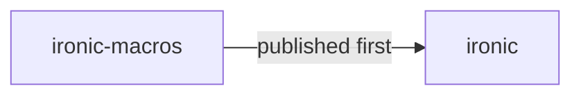

# Production Release Guide

## Overview

Releasing to production is a **process**, not a button. This guide covers release workflows, CI/CD pipelines, versioning strategies, and rollout patterns for both Ironic framework releases and applications built with Ironic.

---

## ironic vs application releases

Ironic uses a two-tier release model:

| Tier | What | Tools |
|------|------|-------|
| **ironic** | `ironic` crate & sub-crates on crates.io | `scripts/release.sh` + GitHub Actions |
| **Application** | Your project binary deployed to servers | Generated CI + Docker + orchestrator |

---

## ironic release process

The entire framework release is automated via `scripts/release.sh`:

```
./scripts/release.sh              → release current version
./scripts/release.sh patch        → bump patch (1.0.0 → 1.0.1)
./scripts/release.sh minor        → bump minor (1.0.0 → 1.1.0)
./scripts/release.sh major        → bump major (1.0.0 → 2.0.0)
```

### What the script does

```
┌──────────────────────────────────────────────────┐
│  1. Bump version in Cargo.toml & sync deps       │
│  2. Generate CHANGELOG.md from git log           │
│  3. Sync version references in docs              │
│  4. Create blog post + release notes             │
│  5. Update releases index + series pages         │
│  6. Run pre-flight checks:                       │
│     ├─ cargo fmt --all -- --check                │
│     ├─ cargo clippy --all-features -D warnings   │
│     ├─ cargo test --all-features                 │
│     └─ npm run build (docs)                      │
│  7. Commit, tag, and push to GitHub              │
│  8. GitHub Actions publishes to crates.io        │
└──────────────────────────────────────────────────┘
```

### crates.io publish order

Since `ironic-macros` is a dependency of `ironic`, publish order matters:



The `release.yml` workflow handles this automatically: it publishes `crates/ironic-macros` first, then the root `ironic` crate.

---

## Application release workflow

### 1. Build & test

Every push to `main` triggers CI:

```yaml
# .github/workflows/ci.yml
- run: cargo fmt --all -- --check
- run: cargo clippy --workspace --all-targets --all-features -- -D warnings
- run: cargo test --all-features
- run: cargo audit
- run: cargo deny check
```

### 2. Create a release tag

```bash
git tag -a v1.2.3 -m "Release v1.2.3"
git push origin v1.2.3
```

### 3. Automated release pipeline

The tag push triggers the release workflow which:

1. **Verifies**: fmt, clippy, tests, audit, deny
2. **Builds**: release binary with LTO and stripping
3. **Packages**: builds Docker image, pushes to registry
4. **Deploys**: updates staging/production environments

### 4. Rollout strategies

| Strategy | How | Best for |
|----------|-----|----------|
| **Rolling update** | Orchestrator replaces instances one-by-one | Stateless APIs |
| **Blue/green** | Two full environments, switch traffic | Stateful services |
| **Canary** | Route small % of traffic to new version | High-risk changes |
| **Feature flags** | Toggle code paths at runtime via `FeatureToggle` | Gradual rollouts |

Ironic's `FeatureToggle` system supports runtime toggles with hot-reload:

```rust
let toggle = FeatureToggle::from_root_config(&config, "new_checkout_flow");
if toggle.is_enabled() {
    // new logic
} else {
    // old logic
}
```

---

## Version numbering

Ironic follows [Semantic Versioning 2.0.0](https://semver.org/):

| Component | Meaning | Example |
|-----------|---------|---------|
| **Major** | Breaking API changes | 1.0.0 → 2.0.0 |
| **Minor** | New features, non-breaking | 1.0.0 → 1.1.0 |
| **Patch** | Bug fixes, docs, internal changes | 1.0.0 → 1.0.1 |

### Breaking changes require a major bump

- Removal or rename of public APIs
- Changes to trait bounds on public traits
- Changes to default feature sets
- MSRV (Minimum Supported Rust Version) bumps
- Upgrade of a re-exported dependency major version

### What is NOT breaking

- Adding new APIs, modules, or features
- Deprecating existing APIs (with warning)
- Internal refactors

---

## Changelog conventions

Ironic uses [Keep a Changelog](https://keepachangelog.com/) format with [Conventional Commits](https://www.conventionalcommits.org/):

| Commit prefix | Changelog section |
|---------------|-------------------|
| `feat:` | Added |
| `fix:` | Fixed |
| `docs:` | Changed |
| `chore:` | Changed |
| `refactor:` | Changed |
| `test:` | Changed |
| `perf:` | Changed |
| `security:` | Security |

---

## Hotfix releases

For critical security fixes, skip the normal cadence:

```bash
git checkout main
git cherry-pick <fix-commit>
./scripts/release.sh patch
```

The release script will generate the changelog from only the cherry-picked commits.

---

## Pre-flight checklist

Run this before every release:

### Code quality
- [ ] `cargo fmt --all -- --check` — no formatting issues
- [ ] `cargo clippy --workspace --all-targets --all-features -- -D warnings` — zero warnings
- [ ] `cargo test --all-features` — all tests pass
- [ ] `cargo audit` — no known advisories
- [ ] `cargo deny check` — no license or duplicate issues

### Documentation
- [ ] CHANGELOG.md is up to date
- [ ] Blog post generated/new release notes written
- [ ] Releases index and series pages regenerated
- [ ] Docs site builds: `npm --prefix docs run build`

### CI/CD
- [ ] CI workflow passes on main branch
- [ ] Release workflow is configured with `CARGO_REGISTRY_TOKEN` secret
- [ ] Dependabot is configured for dependency updates
- [ ] GitHub Pages deployment is configured for docs site

### Security
- [ ] SECURITY.md has correct supported versions
- [ ] No secrets committed to the repository
- [ ] `unsafe_code` is still forbidden at workspace level

---

## Rollback plan

If a release has issues:

1. **Revert the code**: `git revert <merge-commit>`
2. **Bump patch version**: `./scripts/release.sh patch`
3. **Publish the revert**: push the tag
4. **Deploy the fixed version** through your normal pipeline

Feature flags (`FeatureToggle`) can also disable problematic features at runtime without a full rollback.

---

## What you learned

- [x] ironic releases are fully automated via `scripts/release.sh` + GitHub Actions
- [x] Application releases use the CI/CD pipeline generated by `ironic new`
- [x] Version numbering follows SemVer: major (breaking), minor (features), patch (fixes)
- [x] Changelog follows Keep a Changelog with Conventional Commits
- [x] Hotfix releases skip the normal cadence for critical fixes
- [x] Pre-flight checklist catches issues before they reach users
- [x] Rollback plan uses revert commits + patch bumps
- [x] Feature flags enable gradual rollouts without redeployment

## Next steps

- [Deployment guide](./deployment) — containers, reverse proxy, graceful shutdown
- [Benchmarks](./benchmarks) — performance characteristics
